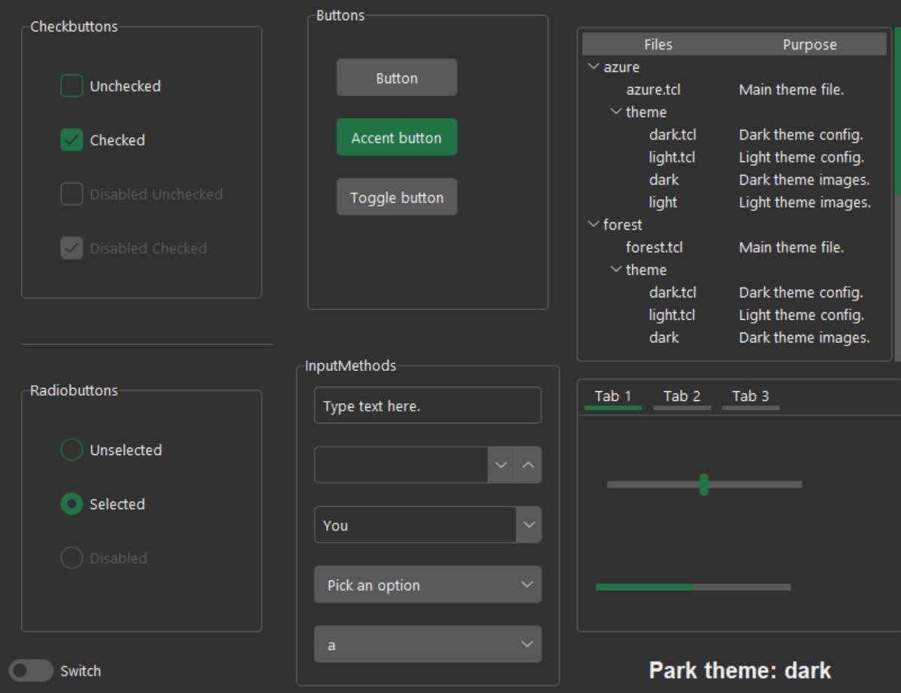
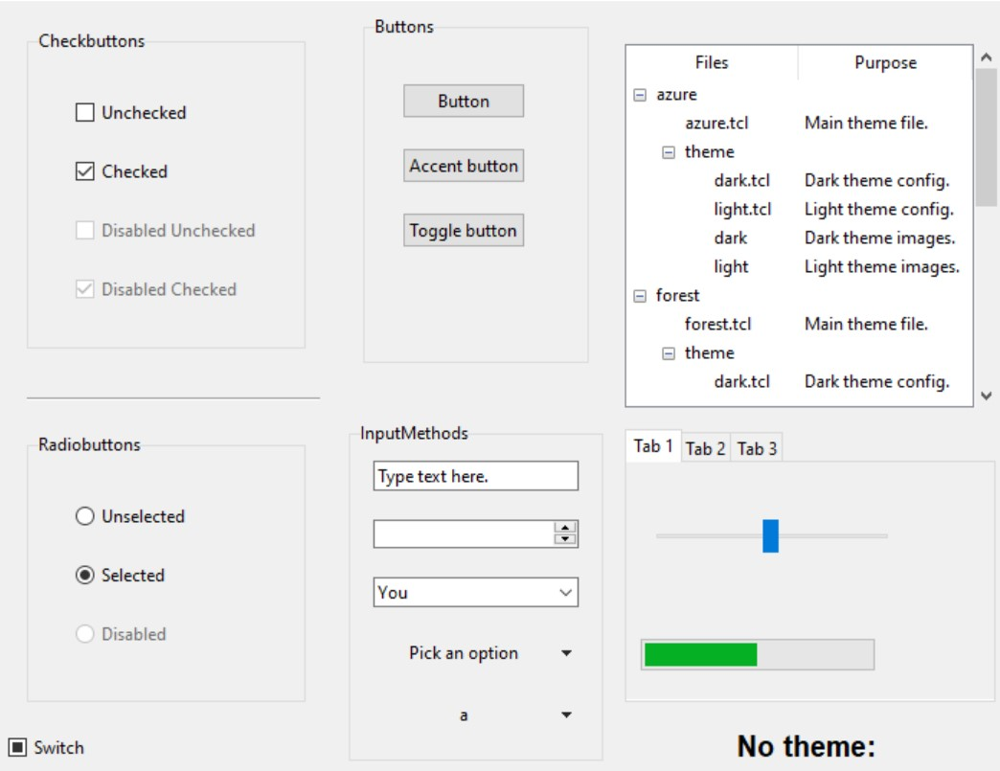
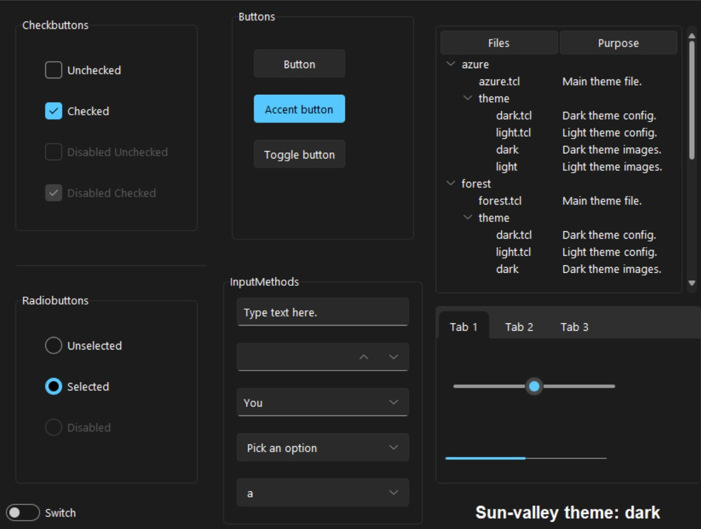
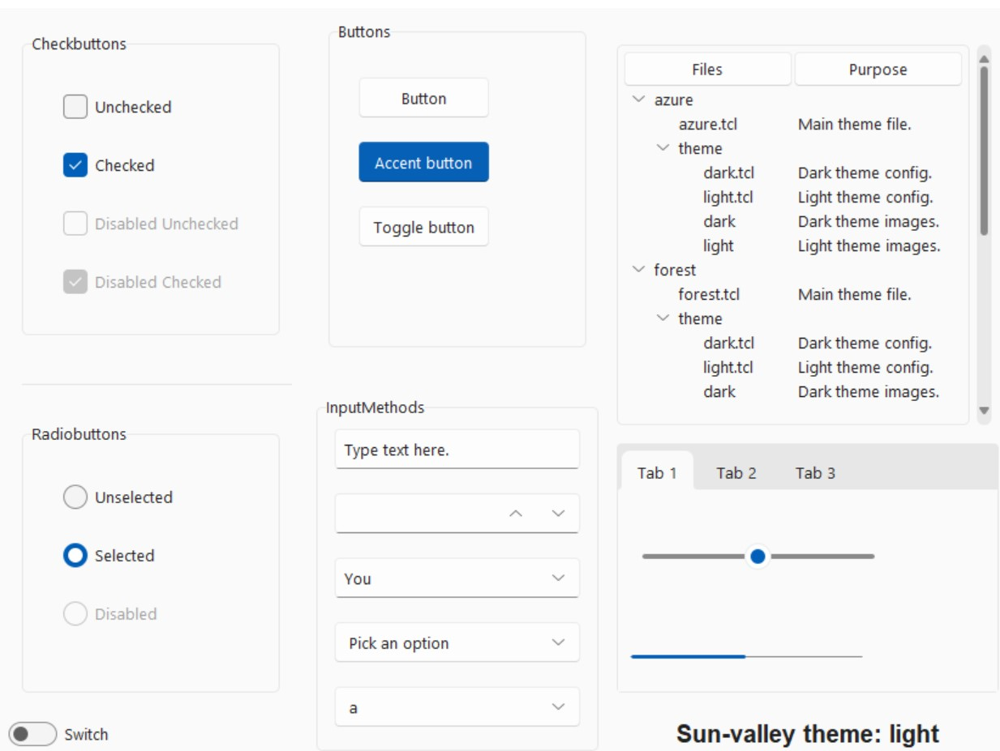
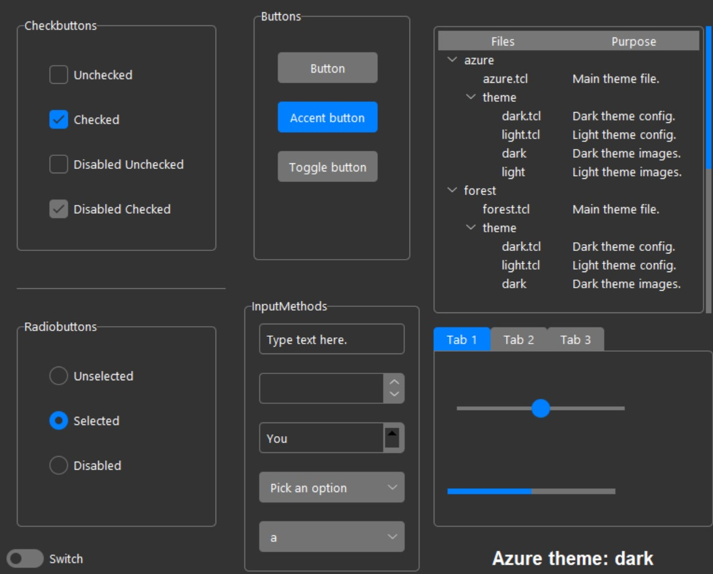
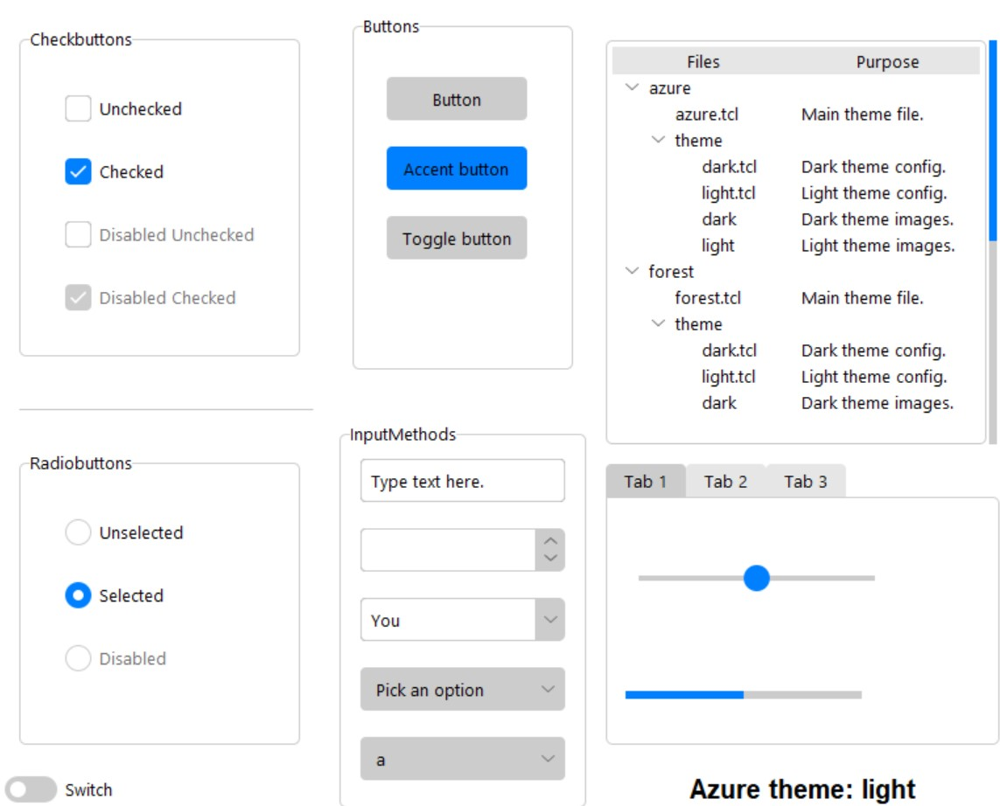

# TKinter Modern Themes




Tkinter is a powerful UI library included in the python standard library.
Unfortunately, it is hard to customize and looks ugly by default.
This library contains a set of modern themes to improve the look of tkinter.

The themes in this library were developed by rdbende and licensed under the MIT license.
https://github.com/rdbende
This library makes these themes consistent and easier to implement into an existing project.

This library also has code to implement WidgetFrames, an
expansion on TKinter's label frames that make creating complex
layouts much quicker and more readable.

## Installation

`pip install TKinterModernThemes`

## Why use themes?
Tkinter looks really ugly be default.



These themes look much better, and take the same amount of time to code
because they don't need to be manually customized.

## Included Themes

Each theme has a light and dark mode.

### Park
Park is a modified version of Forest in order to make it consistent
with the other themes. It is inspired by Excel.


### Sun-valley
Sun-valley is designed to look like Windows 11.




### Azure
Azure is similar to park, with a blue as the accent color.




## Integration

These themes can be added by creating a themed frame.
A theme and mode (dark/light) can be specified.
If you need multiple windows, all but one should be marked as topLevel.

The frame for the app can be accessed by `self.root`, but WidgetFrames
provide a cleaner alternative.

## Widget Frames

In this library, everything that supports adding widgets is a widget frame.
Instead of creating a widget and later adding it to a frame, widget frames combine these
steps. They also provide much better defaulting and doc strings then default tkinter.

## Example:
```python
import TKinterModernThemes as TKMT

def buttonCMD():
        print("Button clicked!")

class App(TKMT.ThemedTKinterFrame):
    def __init__(self):
        super().__init__(str("TITLE"), str("park"), str("dark"))
        self.button_frame = self.addLabelFrame(str("Frame Label"))
        self.button_frame.Button(str("Button Text"), buttonCMD) #the button is dropped straight into the frame
        self.run()

App()
```

The widgets have params for the common use cases. If more params are needed, they can be
passed as dicts to `**widgetkwargs` and `**gridkwargs` respectively.

WidgetFrames can be combined with normal tkinter use. Note: debugPrint() will only
display widgets created from the WidgetFrame. Custom created
widgets can be linked to the WidgetFrame by appending them to
`WidgetFrame.widgets.widgetlist` (this also allows for overlap checking)

```python
import TKinterModernThemes as TKMT
from TKinterModernThemes.WidgetFrame import Widget
from tkinter import ttk


def buttonCMD():
        print("Button clicked!")


class App(TKMT.ThemedTKinterFrame):
        def __init__(self, theme, mode, usecommandlineargs=True, usethemeconfigfile=True):
                super().__init__(str("TITLE"), theme, mode, usecommandlineargs, usethemeconfigfile)
                self.Button(str("Auto placed button!"), buttonCMD)  # placed at row 0, col 0

                self.button_frame = self.addLabelFrame(str("Frame Label"))  # placed at row 1, col 0

                self.button_frame.Button(str("Button Text"), buttonCMD)  # the button is dropped straight into the frame

                button = ttk.Button(self.button_frame.master, text="Button in frame!")
                button.grid(row=1, column=0, padx=10, pady=10, sticky='nsew')

                button = ttk.Button(self.master, text="Button outside frame!")
                button.grid(row=2, column=0, padx=10, pady=10, sticky='nsew')

                button = ttk.Button(self.master, text="debugPrint() finds this button")
                button.grid(row=3, column=0, padx=10, pady=10, sticky='nsew')
                self.widgets.widgetlist.append(Widget(button, str("Button"), 3, 0, 1, 1,
                                                      "debugPrint() finds this button"))
                self.debugPrint()
                self.run()


if __name__ == "__main__":
        App(str("park"), str("dark"))
```

WidgetFrames adds new items to each column below the last placed item in that column.
WidgetFrame.debugPrint() can be used to see how the widget is attempting
to place each item.
Items can be manually placed with the row and col params. If two items overlap, 
a warning will be printed upon widget creation.

## Setting the theme:

The theme is set by default to "park" with mode "dark". This can be overrided
with parameters in `super().__init__()`

- title: Window title 
- theme: Main theme file. One of (azure / sun-valley / park). Defaults to park.
- mode: Light or dark theme. One of (light / dark). Defaults to dark.
- usecommandlineargs: If this is True (default), the frame checks for params passed into the script
        launch to grab a theme.
- useconfigfile: If this is True (default), the frame checks for a file named themeconfig.json and seaches for
        theme and mode. Config files override command line args.
- topLevel: If this is True (default = False), this window will be a topLevel window
        and inherit its theme and root from the main window. This is necessary if you
        have multiple windows.

By default, themeconfig.json overrides command line args, which overrides manually passed in themes,
which override the defaults.

## Notebooks and Paned Windows

Notebooks and paned windows have been modified to include
widget frame capabilities.

```python
import TKinterModernThemes as TKMT

class App(TKMT.ThemedTKinterFrame):
    def __init__(self):
        super().__init__(str("TKinter Custom Themes Demo"))
        
        self.panedWindow = self.PanedWindow("Paned Window Test")
        self.pane1 = self.panedWindow.addWindow() #pane1 is a widget frame

        self.notebook = self.pane1.Notebook("Notebook Test")
        self.tab1 = self.notebook.addTab("Tab Title") #tab1 is a widget frame
```

## Resizable Windows

The main app will recursively resize all subframes. This can be
turned off with the `cleanResize` param in `run()`. Only frames
makes this resize only apply to frames that only have subframes, not
widgets. This generally looks better, but can be disabled by setting
`onlyFrames` to False.

Resizing can also be manually added to a frame by calling
`makeResizable()`.

## New Widgets:

### SlideSwitch

A variant of a checkbox that looks like a switch.

```python
import TKinterModernThemes as TKMT
import tkinter as tk


class App(TKMT.ThemedTKinterFrame):
        def __init__(self, theme, mode, usecommandlineargs=True, usethemeconfigfile=True):
                super().__init__(str("Switch"), theme, mode, usecommandlineargs=usecommandlineargs,
                                 useconfigfile=usethemeconfigfile)
                self.switchframe = self.addLabelFrame(str("Switch Frame"))
                self.switchvar = tk.BooleanVar()
                self.switchframe.SlideSwitch("Switch", self.switchvar)
                self.run()


if __name__ == "__main__":
        App(str("park"), str("dark"))
```


### ToggleButton

A variant of a checkbox that looks like a button.

```python
import TKinterModernThemes as TKMT
import tkinter as tk


class App(TKMT.ThemedTKinterFrame):
        def __init__(self, theme, mode, usecommandlineargs=True, usethemeconfigfile=True):
                super().__init__(str("Toggle button"), theme, mode,
                                 usecommandlineargs=usecommandlineargs, useconfigfile=usethemeconfigfile)
                self.togglebuttonframe = self.addLabelFrame(str("Toggle Button Frame"))
                self.togglebuttonvar = tk.BooleanVar()
                # Togglebutton
                self.togglebutton = self.togglebuttonframe.ToggleButton(text="Toggle button",
                                                                        variable=self.togglebuttonvar)
                self.run()


if __name__ == "__main__":
        App(str("park"), str("dark"))
```


### AccentButton

A button that has a default color of a clicked button.

```python
import TKinterModernThemes as TKMT


def handleButtonClick():
        print("Button clicked!")


class App(TKMT.ThemedTKinterFrame):
        def __init__(self, theme, mode, usecommandlineargs=True, usethemeconfigfile=True):
                super().__init__(str("Accent button"), theme, mode,
                                 usecommandlineargs=usecommandlineargs, useconfigfile=usethemeconfigfile)

                self.frame = self.addLabelFrame(str("Accent Button Frame"))
                self.frame.AccentButton("Accent Button", handleButtonClick)
                self.run()


if __name__ == "__main__":
        App(str("park"), str("dark"))
```

See [allwidgets.py](TKinterModernThemes/examples/allwidgets.py) for info on each widget.
See [examples](TKinterModernThemes/examples) for more examples on using TKMT frames.

## Matplotlib integration

TKMT can work with matplotlib. See `WidgetFrame.matplotlibFrame` for more info.

### Example:
```python
import TKinterModernThemes as TKMT
import random

class App(TKMT.ThemedTKinterFrame):
    def __init__(self): 
        super().__init__(str("Matplotlib Example"))

        self.graphframe = self.addLabelFrame(str("2D Graph"))
        self.graphframe2 = self.addLabelFrame(str("3D Graph"), col=1)
        self.canvas, fig, self.ax, background, self.accent = self.graphframe.matplotlibFrame("Graph Frame Test")
        self.canvas2, fig2, self.ax2, _, _ = self.graphframe2.matplotlibFrame("Graph 3D", projection='3d')
        buttonframe = self.addLabelFrame(str("Control Buttons"), colspan=2)
        buttonframe.Button("Add Data", self.addData)
        self.run()

    def addData(self):
        x = []
        y = []
        z = []

        for i in range(0, 100):
            for l in [x, y, z]:
                l.append(random.random() * 100)

        self.ax.scatter(x, y, c=self.accent)
        self.ax2.scatter(x, y, z, c=self.accent)
        self.canvas.draw()
        self.canvas2.draw()

if __name__ == "__main__":
    App()
```
