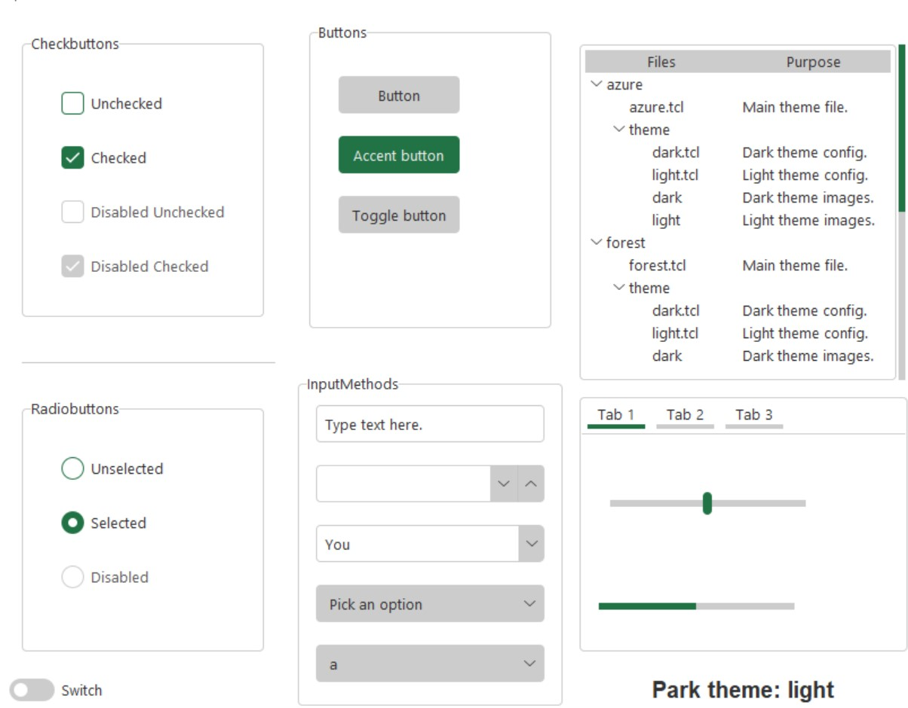

# TKinter Modern Themes


Tkinter is a powerful UI library included in the python standard library.
Unfortunately, it is hard to customize and looks ugly by default.
This library contains a set of modern themes to improve the look of tkinter.

The themes in this library were developed by rdbende and licensed under the MIT license.
https://github.com/rdbende
This library makes these themes consistent and easier to implement into an existing project.

## Why use themes?
Tkinter looks really ugly be default.


These themes look much better, and take the same amount of time to code
because they don't need to be manually customized.

## Included Themes

Each theme has a light and dark mode.

### Park
Park is a modified version of Forest in order to make it consistent
with the other themes. It is inspired by Excel.




### Sun-valley
Sun-valley is designed to look like Windows 11.


### Azure
Azure is similar to forest, with a blue as the accent color.


## Installation

`pip install git+https://RobertJN64/TKinterModernThemes`

## Integration

These themes can be added by creating a themed frame.
A theme and mode (dark/light) can be specified.
If the file is in a unusual location, an relative path
might need to be included.

## Example:
```python
import TKinterModernThemes as TKMT

class App(TKMT.ThemedTKinterFrame):
    def __init__(self):
        super().__init__(str("TITLE"), str("park"), str("dark"))
        
        #add your widgets here
        self.run()
```

## Widgets:

### SlideSwitch

A variant of a checkbox that looks like a switch.
```python
import TKinterModernThemes as TKMT
from tkinter import ttk
import tkinter as tk

class App(TKMT.ThemedTKinterFrame):
    def __init__(self):
        super().__init__(str("Switch"), str("park"), str("dark"))
        self.switchvar = tk.BooleanVar()
        self.switch = ttk.Checkbutton(self, text="Switch", variable=self.switchvar, style=TKMT.ThemeStyles.SlideSwitch)
        self.switch.grid(row=0, column=0, padx=5, pady=5, sticky="nsew")
        #add your widgets here
        self.run()

App()
```


### ToggleButton

A variant of a checkbox that looks like a button.
```python
import TKinterModernThemes as TKMT
from tkinter import ttk
import tkinter as tk

class App(TKMT.ThemedTKinterFrame):
    def __init__(self):
        super().__init__(str("Toggle button"), str("park"), str("dark"))
        self.togglebuttonvar = tk.BooleanVar()
        # Togglebutton
        self.togglebutton = ttk.Checkbutton(self, text="Toggle button", style=TKMT.ThemeStyles.ToggleButton,variable=self.togglebuttonvar)
        self.togglebutton.grid(row=2, column=0, padx=5, pady=10, sticky="nsew")
        #add your widgets here
        self.run()

App()
```


### AccentButton

A button that has a default color of a clicked button.
```python
import TKinterModernThemes as TKMT
from tkinter import ttk

def handleButtonClick():
    print("Button clicked!")

class App(TKMT.ThemedTKinterFrame):
    def __init__(self):
        super().__init__(str("Accent Button"), str("park"), str("dark"))
        self.accentbutton = ttk.Button(self, text="Accent button", style=TKMT.ThemeStyles.AccentButton, 
                                       command=handleButtonClick)
        self.accentbutton.grid(row=1, column=0, padx=5, pady=10, sticky="nsew")
        #add your widgets here
        self.run()

App()
```


See [example.py](TKinterModernThemes/examples/example.py) for more info.